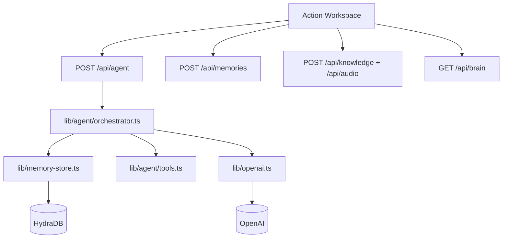

# Action Brain

Action Brain is a memory-driven action agent for turning messy input into concrete outcomes.

It combines durable HydraDB memory, OpenAI reasoning, explicit tools, recovery behavior, and outcome writeback into a demoable agent system. The app is designed for high-pressure situations where the user may provide incomplete notes, change direction mid-flow, or need a useful result even when memory, tools, or model calls are imperfect.

## What It Does

Action Brain helps a user move from scattered context to action.

The core loop is:

```text
User goal
  -> retrieve relevant memory
  -> interpret intent
  -> create or revise a plan
  -> select an explicit tool
  -> execute the tool
  -> recover from missing or broken context
  -> produce an action-oriented output
  -> write important outcomes back to memory
```

Instead of only answering questions, Action Brain produces artifacts the user can act on:

- task lists and checklists
- practical plans
- ranked options
- short summaries
- email or follow-up drafts
- unresolved-item lists
- recovery notes
- execution history

## Capabilities

### Durable Memory Foundation

Action Brain uses HydraDB as the long-term memory and context layer.

Memory is stored with structured metadata so the agent can distinguish different types of context:

- `idea`
- `task`
- `decision`
- `preference`
- `plan`
- `unresolved_item`
- `execution_history`
- `failure_recovery`

The app supports direct memory capture through the Memory tab. Users can save context as a specific memory kind and add `#tags` inline.

Examples:

```text
I prefer concise plans with no more than five steps. #preference
```

```text
The demo must show memory retrieval, tool usage, recovery, and writeback. #hackathon #plan
```

### Retrieval Before Action

Every agent run starts by retrieving relevant HydraDB context for the current goal.

The retrieval layer uses:

- semantic recall
- preference recall
- tag-aware filtering
- result deduplication
- relevancy sorting
- graph-compatible metadata

This lets the agent adapt its output to saved preferences, previous decisions, unresolved work, and past execution history.

### Agent Orchestration

The main agent flow lives behind `POST /api/agent`.

For each request, the orchestrator:

1. Creates a unique agent run ID.
2. Retrieves relevant memory.
3. Interprets the user’s intent.
4. Detects likely goal changes or ambiguity.
5. Builds an execution plan.
6. Selects the best available tool.
7. Executes the tool.
8. Generates a final action-oriented output.
9. Records recovery events.
10. Saves checkpoints, outcomes, and recovery notes back to HydraDB.

The UI exposes this process directly through:

- final output
- interpreted intent
- plan steps
- tool trace
- recovery notes
- memory evidence
- saved outcomes

### Explicit Tool System

Action Brain uses a modular tool registry instead of hiding all behavior inside a single prompt.

Current tools:

| Tool | Purpose |
| --- | --- |
| `create_tasks` | Turns messy notes or ideas into a concrete checklist. |
| `summarize_notes` | Condenses input and retrieved memory into a decision-ready summary. |
| `draft_output` | Drafts emails, follow-ups, updates, or short written artifacts. |
| `rank_options` | Ranks options using the request and remembered preferences. |
| `extract_unresolved_items` | Finds blockers, unanswered questions, and next actions. |
| `general_action` | Produces a practical response when no specialized tool fits. |

The registry makes the system extensible. New tools can be added without changing the entire orchestration flow.

### Memory Writeback

Action Brain does not treat each run as disposable.

Important agent events are written back into memory:

- run checkpoints
- final outputs
- completed execution history
- recovery notes
- failure records

This means future runs can learn from previous attempts. A failed or partial run still becomes useful context for the next run.

### Markdown Knowledge Upload

The Upload tab supports Markdown knowledge ingestion.

Uploaded `.md` files are indexed in HydraDB and can be used by future agent runs. Optional context and tags can be attached to the upload.

Use this for:

- project notes
- hackathon requirements
- meeting notes
- planning docs
- product ideas
- decision logs

### Audio Capture

The Upload tab supports audio capture through:

- browser recording
- audio file upload
- OpenAI transcription
- automatic memory save

This makes the app useful for quick voice notes, meetings, or high-pressure capture when typing is too slow.

### Voice Input

The main text area includes browser speech input for fast goal capture.

The user can speak a rough goal, edit the transcript, then run the agent or save the text as memory.

### Memory Graph

The Graph tab visualizes HydraDB memory relationships when graph data is available.

This is useful for demonstrating that memories are not just flat text blobs. The graph can show connected concepts, entities, and relationships that emerge from captured context.

## How The Agent Performs Under Pressure

Action Brain is built around imperfect operating conditions.

The user may be rushed. Their request may be vague. Memory may be missing. External APIs may fail. The goal may change. The app is designed to keep producing useful progress rather than failing silently.

### Missing Memory

If HydraDB has no relevant memory, the agent does not stop.

It:

- records a `missing_memory` recovery event
- continues with a best-effort output
- explains that no saved context was available
- attempts to save the outcome so future runs have context

This matters in a demo because the first run can still be useful, and the second run becomes smarter.

### Missing API Keys Or Integration Failure

If HydraDB or OpenAI is not configured, Action Brain still exposes fallback behavior.

For example:

- if HydraDB retrieval fails, the agent continues without recalled context
- if OpenAI interpretation fails, deterministic intent detection runs locally
- if plan generation fails, a fallback plan is created
- if final response generation fails, the tool output and recovery notes are assembled into a final response
- if memory writeback fails, the UI still shows the completed run and why writeback failed

The app is therefore demoable even while integrations are being configured, and integration failures are visible instead of hidden.

### Ambiguous Requests

If the user gives an unclear request such as:

```text
Help me with it.
```

Action Brain marks the run as ambiguous and continues with a practical interpretation.

It can surface a clarifying question while still producing a partial output. This avoids the worst failure mode for agents: stopping completely when the user needs momentum.

### Goal Changes Mid-Flow

Action Brain detects adaptation language such as:

```text
Actually rank those ideas instead.
```

```text
Make it shorter and more practical.
```

```text
Turn this into an email draft instead.
```

When this happens, the agent treats the latest request as a revision rather than a cold restart. It preserves available context, updates intent, selects a new tool if needed, and records the adaptation in recovery notes.

### Tool Failures

Tool execution returns structured results:

- `success`
- `partial`
- `failed`

If a tool fails, the agent records a `tool_failure` recovery event and continues with available partial state. This keeps the UI honest and gives the user something actionable instead of an unexplained error.

### Partial Execution

A run can complete with recovery.

This is important under pressure because “partially completed with a clear explanation” is often more valuable than “failed”.

The UI shows:

- what worked
- what failed
- what fallback was used
- what was saved
- what memory was missing

### Checkpointing

The agent attempts to save:

- the start of the run
- the final output
- recovery events

These checkpoints make the system resilient. Even if the current task is messy, the next task can use what happened.

## Architecture



## Key Files

| Area | File |
| --- | --- |
| Main UI | `components/action-workspace.tsx` |
| Trace UI | `components/agent-trace-panel.tsx` |
| Agent API | `app/api/agent/route.ts` |
| Agent orchestration | `lib/agent/orchestrator.ts` |
| Tool registry | `lib/agent/tools.ts` |
| HydraDB memory layer | `lib/memory-store.ts` |
| OpenAI helpers | `lib/openai.ts` |
| Validation | `lib/validation.ts` |
| Shared types | `lib/types.ts` |

## API Routes

| Route | Purpose |
| --- | --- |
| `POST /api/agent` | Run the memory-driven action agent. |
| `POST /api/memories` | Save a structured memory record. |
| `POST /api/knowledge` | Upload Markdown knowledge to HydraDB. |
| `POST /api/audio` | Transcribe audio and save it as memory. |
| `GET /api/brain` | Fetch graph data for the memory graph. |

## Environment

Copy `.env.example` to `.env.local` and fill:

```bash
OPENAI_API_KEY=
OPENAI_ANSWER_MODEL=gpt-4o-mini
OPENAI_TRANSCRIBE_MODEL=gpt-4o-mini-transcribe
HYDRADB_API_KEY=
HYDRADB_PROJECT_ID=
HYDRADB_SUB_TENANT_ID=action_demo_user
HYDRADB_URL=
```

## Run Locally

```bash
npm install
npm run dev
```

Open:

```text
http://localhost:3000
```

If port `3000` is already in use, Next.js will choose another local port.

## Validate

```bash
npm run lint
npm run build
```

## Demo Scenarios

### 1. Save A Preference

Use the Memory tab:

```text
I prefer practical plans with 3-5 steps, clear owners, and no vague strategy language. #preference
```

Then run an agent request that should use that preference.

### 2. Turn Messy Notes Into Tasks

Use the Agent tab:

```text
Turn these launch ideas into a practical checklist: landing page, demo script, memory proof, failure recovery example, graph view, and final pitch.
```

Expected result:

- retrieved memory evidence if available
- `create_tasks` tool call
- checklist output
- execution history writeback

### 3. Adapt The Goal

Run:

```text
Actually rank those ideas instead and keep it shorter.
```

Expected result:

- adaptation detected
- revised intent
- `rank_options` tool call
- recovery note explaining the goal shift

### 4. Test Ambiguity Recovery

Run:

```text
Help me with it.
```

Expected result:

- ambiguity recovery note
- clarifying question or best-effort interpretation
- partial but useful output

### 5. Draft A Follow-Up

Run:

```text
Draft a follow-up email from my hackathon demo notes. Keep it concise and action-oriented.
```

Expected result:

- `draft_output` tool call
- short email draft
- memory-backed context when available

### 6. Demonstrate Missing Memory Recovery

Run a request before saving any relevant memory.

Expected result:

- visible `missing_memory` recovery event
- best-effort output
- attempted writeback for future context

## Current MVP Constraints

- Single-user demo mode.
- No authentication.
- HydraDB is the durable memory store.
- No separate application database.
- No background worker or queue.
- Tool execution is intentionally explicit and inspectable.

## Why This Is Useful

Action Brain demonstrates an agent that does more than retrieve and answer.

It shows:

- memory retrieval
- planning
- tool selection
- action output
- fallback behavior
- recovery reporting
- adaptation to changed goals
- durable writeback

The result is an agent that feels resilient under pressure because it keeps working when the input is messy and the environment is imperfect.
